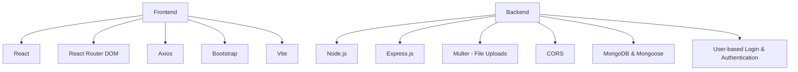

# RealEstateHub - MERN Stack

RealEstateHub is a modern full-stack web application built with the MERN stack — React for the frontend, Node.js and Express.js for the backend, and MongoDB as the database.
It enables users to browse, list, and manage real estate properties with secure user-based login & authentication, responsive UI, and efficient data handling.
The platform supports image uploads, smooth client–server communication, and a scalable architecture for handling real-world real estate management needs.

## 🔑 Backend Key Features
- **User-based Login & Authentication** – Secure login system with role-based access control (Admin: `admin@gmail.com` / `admin123`, Customer: `customer@gmail.com` / `customer123`).
- **Property Management API** – Create, read and delete property listings in MongoDB.
- **File Upload Handling** – Upload and store property images using Multer.
- **Database Integration** – MongoDB with Mongoose for schema-based modeling.
- **CORS Enabled** – Secure cross-origin API communication with the frontend.
- **RESTful API Architecture** – Clean, scalable, and maintainable API design.
- **Error Handling Middleware** – Centralized error handling for better debugging.

---
## 🛠 Tech Stack

**Frontend:**
- React
- React Router DOM
- Axios
- Bootstrap
- Vite

**Backend:**
- Node.js
- Express.js
- Multer (file uploads)
- CORS
- MongoDB & Mongoose
- User-based Login & Authentication


## 📂 Folder Structure
```bash
RealEstateHub/
├── client/             
│   ├── public/         
│   ├── src/            
│   ├── package.json   
│   └── vite.config.js  
│
└── server/            
    ├── model/
    ├── public/images
    ├── server.js  
    └── package.json

```

## ⚙️ Setup

### 1. Server
  ```bash
  cd server
  npm install
  npm start
  ```

### 2. Client
  ```bash
  cd client
  npm install
  npm run dev
  ```

## Author : Harshit Kumar Singh
